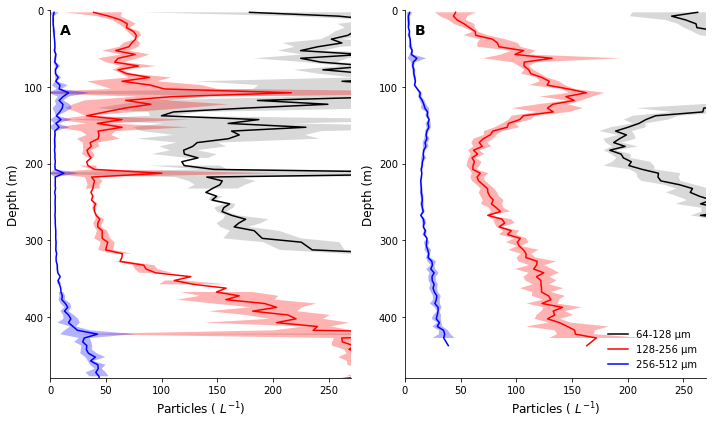
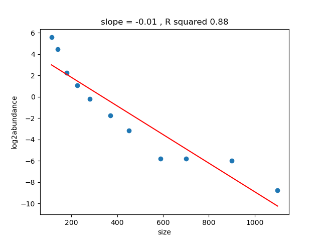
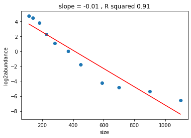

# HE570 Particle Comparison

## Task 1
Prepare all particle abundance data in 5m depth bins and size bins (ESD) according to https://docs.google.com/document/d/1yQU-huOKg90jL4_Po-9pGzpw6x7F0ti5TMEq7QYga5Q/edit

## Task 2
Plot particle abundance profile (5m depth bins) at the central stations in Masfjord and Lurefjord

## Task 3
Plot all camera-derived particle abundance spectra (in the same place, e.g. same depth bin and location, closest timestamp) in one plot to determine cutoffs.
## Task 1
Done for UVP5 and UVP6, available on Ecopart and exported in this Repo.
## Task 2
### UVP5HD
The UVP5HD (serial number 204, Picheral et al., 2010) was running without errors on all BOP profiles. The resulting particle and image data were processed and imported to Ecopart (https://ecotaxa.obs-vlfr.fr/part/) and Ecotaxa (https://ecotaxa.obs-vlfr.fr/prj/4105), respectively. 

UVP5 profiles in three size classes -- not smallest seems to include cutoff (too low)

### UVP6hf
The UVP6hf (serial number sn00012, Picheral et al., 2021) was running without errors on all BOP profiles. The resulting particle and image data were processed and imported to Ecopart (https://ecotaxa.obs-vlfr.fr/part/) and Ecotaxa (https://ecotaxa.obs-vlfr.fr/prj/4515), respectively. 

UVP6 profiles in three size classes -- note smallest seems more realistic

## Task 2

UVP5 spectrum

UVP6 spectrum

