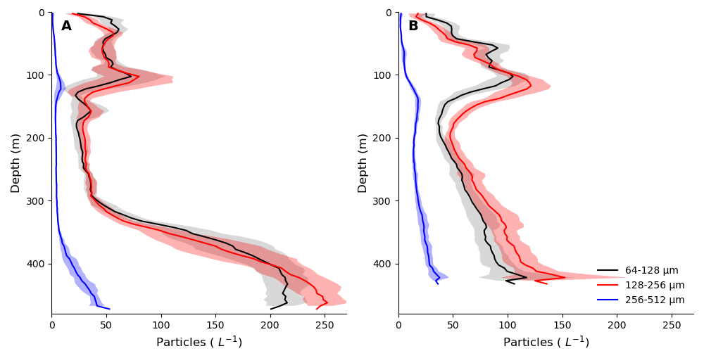
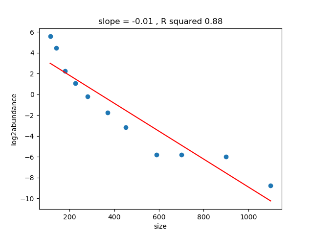

#HE570 particle comparison

##Task 1: Plot particle abundance profile (5m depth bins) at the central stations in Masfjord and Lurefjord

##Task 2: Try to plot all camera-derived particle abundance spectra (in the same place, e.g. same depth bin and location, closest timestamp) in one plot to determine cutoffs.

### UVP5HD
The UVP5 (serial number 204, Picheral et al., 2010) was running without errors on all BOP profiles. The resulting particle and image data were processed and imported to Ecopart (https://ecotaxa.obs-vlfr.fr/part/) and Ecotaxa (https://ecotaxa.obs-vlfr.fr/prj/4105), respectively. 

